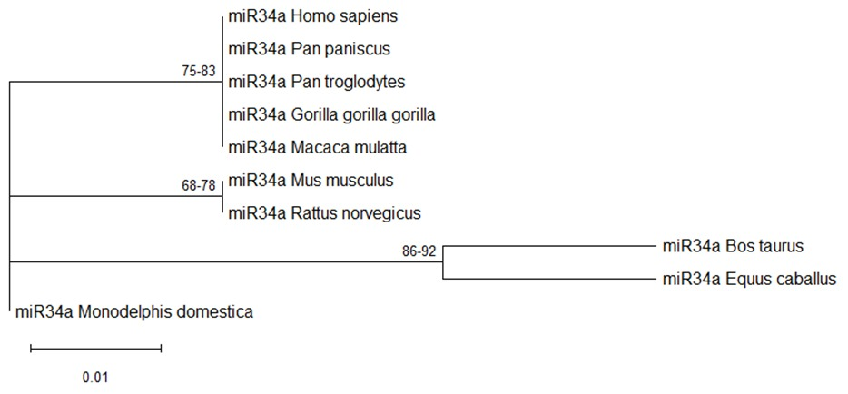

# 🧬 miR34a evolution in Mammalia

Mini projeto desenvolvido na disciplina **“Evolução Genômica e Regulação da Expressão Gênica”** do doutorado, utilizando **NCBI**, **MAFFT**, **TrimAl** e **MEGA12** para analisar a **evolução molecular do miR-34a em mamíferos**.

---

## 📚 Objetivo
Investigar a **evolução e conservação** da sequência do microRNA **miR-34a** entre diferentes grupos de mamíferos, explorando relações filogenéticas e modelos de substituição molecular.

---

## 🧪 Metodologia
1. **Coleta de dados:** sequências precursoras de miR-34a obtidas no NCBI.  
2. **Alinhamento:** realizado com [MAFFT](https://mafft.cbrc.jp/alignment/server/).  
3. **Trimagem:** realizada no [TrimAl (usegalaxy.eu)](https://usegalaxy.eu/).  
4. **Análises filogenéticas:** conduzidas no **MEGA 12**, incluindo:
   - Seleção do melhor modelo evolutivo.
   - Construção de árvore **Maximum Likelihood (ML)**.
   - Construção de árvore **Neighbor-Joining (NJ)** para comparação.

---

## 🌍 Espécies analisadas
- *Homo sapiens*  
- *Pan paniscus*  
- *Pan troglodytes*  
- *Gorilla gorilla gorilla*  
- *Macaca mulatta*  
- *Mus musculus*  
- *Rattus norvegicus*  
- *Bos taurus*  
- *Equus caballus*  
- *Monodelphis domestica*

---

## 📈 Resultados esperados
- Alta conservação da sequência entre primatas e roedores.  
- Divergência evolutiva maior em *Monodelphis domestica* (marsupial).  
- Clados consistentes com a filogenia conhecida dos mamíferos.

---

## 💻 Ferramentas utilizadas
| Ferramenta | Finalidade |
|-------------|-------------|
| [NCBI](https://www.ncbi.nlm.nih.gov/) | Obtenção de sequências |
| [MAFFT](https://mafft.cbrc.jp/alignment/server/) | Alinhamento múltiplo |
| [TrimAl](https://usegalaxy.eu/) | Remoção de regiões mal alinhadas |
| [MEGA12](https://www.megasoftware.net/) | Modelos evolutivos e árvores filogenéticas |

## Resultados 

### Árvore Filogenética

*Figura 1: Árvore filogenética do miR-34a em mamíferos*

---
